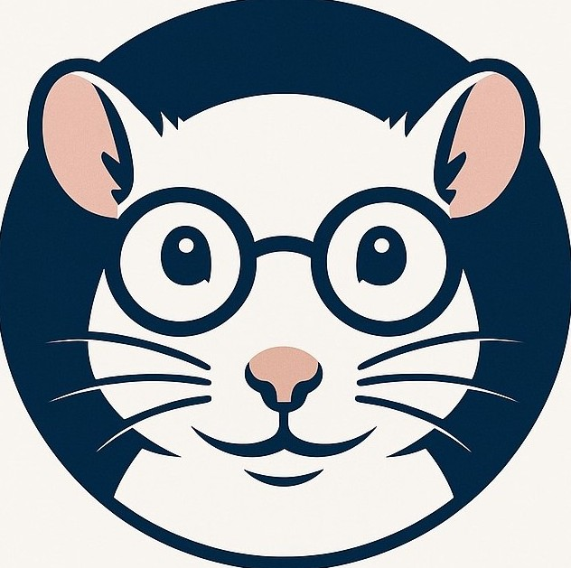

<!DOCTYPE html>
<html lang="es">
<head>
<meta charset="UTF-8" />
<title>LAB RAT Web · Tu primera PC</title>
<meta name="viewport" content="width=device-width, initial-scale=1" />
<meta name="description" content="Guía sencilla de partes de PC para personas que van a armar su primera computadora." />

</head>
<body>

<header class="site-header">

<a href="file:///C:/Users/rosad/OneDrive/Manga%20Iguana/INTER/WEB%20DEV%20CLIENT%20%20front%20end/final%20project/index%201.html" class="brand">

LAB RAT

</a>
<nav class="navbar">
<a href="file:///C:/Users/rosad/OneDrive/Manga%20Iguana/INTER/WEB%20DEV%20CLIENT%20%20front%20end/final%20project/index%201.html">Home</a>
<a href="file:///C:/Users/rosad/OneDrive/Manga%20Iguana/INTER/WEB%20DEV%20CLIENT%20%20front%20end/final%20project/index%202.html">Build</a>
<a href="file:///C:/Users/rosad/OneDrive/Manga%20Iguana/INTER/WEB%20DEV%20CLIENT%20%20front%20end/final%20project/index%205.html">Guia</a>
<a href="file:///C:/Users/rosad/OneDrive/Manga%20Iguana/INTER/WEB%20DEV%20CLIENT%20%20front%20end/final%20project/index%203.html">Contactanos</a>
</nav>

</header>
<main class="container">
<section class="card">
<h1 class="hero-title">Partes básicas de una PC</h1>

Si vas a armar tu primera computadora, estas son las piezas principales que
debes conocer y para qué sirve cada una.

<article class="part-block">
<h2 class="part-title">CPU El cerebro</h2>

Procesa todas las instrucciones y tareas.

Tip: para estudiar y jugar, una CPU de gama media es suficiente.

</article>
<article class="part-block">
<h2 class="part-title">GPU Gráficos</h2>

Dibuja juegos, videos y gráficos 3D.

Tip: es clave si piensas jugar o editar video.

</article>
<article class="part-block">
<h2 class="part-title">RAM Memoria</h2>

Permite abrir varios programas sin lentitud.

Tip: 16 GB es el punto ideal hoy en día.

</article>
<article class="part-block">
<h2 class="part-title">SSD / HDD Almacenamiento</h2>

Guarda tu sistema, programas y archivos.

Tip: usa SSD para velocidad.

</article>
<article class="part-block">
<h2 class="part-title">Motherboard Base</h2>

Conecta todas las partes.

Tip: verifica compatibilidad con CPU y RAM.

</article>
<article class="part-block">
<h2 class="part-title">PSU Energía</h2>

Alimenta todo el sistema.

Tip: nunca compres fuentes genéricas.

</article>

</section>
<section class="card">
<h2 class="articles-title">Artículos recomendados para principiantes</h2>

<article class="article-card">
<h3 class="article-title">¿Qué PC me conviene para estudiar y jugar?</h3>

Guía sencilla para elegir componentes si quieres una PC que sirva tanto para clases como para gaming ligero.

<a href="file:///C:/Users/rosad/OneDrive/Manga%20Iguana/INTER/WEB%20DEV%20CLIENT%20%20front%20end/final%20project/index%204.html" class="article-link">Leer más</a>
</article>
<article class="article-card">
<h3 class="article-title">Errores comunes al armar tu primera PC</h3>

Cosas que deberías evitar: fuentes genéricas, mala ventilación, incompatibilidades y más.

<a href="file:///C:/Users/rosad/OneDrive/Manga%20Iguana/INTER/WEB%20DEV%20CLIENT%20%20front%20end/final%20project/index%206.html" class="article-link">Leer más</a>
</article>
<article class="article-card">
<h3 class="article-title">Cómo planear un presupuesto para tu PC</h3>

Aprende a repartir tu dinero entre CPU, GPU, RAM y otros componentes sin romper la alcancía.

<a href="file:///C:/Users/rosad/OneDrive/Manga%20Iguana/INTER/WEB%20DEV%20CLIENT%20%20front%20end/final%20project/index%207.html" class="article-link">Leer más</a>
</article>

</section>
</main>
<footer class="site-footer">

<footer>
©  LAB RAT
</footer>

</footer>

</body>
</html>
<!DOCTYPE html>
<html lang="es">
<head>
<meta charset="UTF-8" />
<title>LAB RAT PC Builder · Opciones</title>
<meta name="viewport" content="width=device-width, initial-scale=1" />

</head>
<body>

<header class="site-header">

<a href="file:///C:/Users/rosad/OneDrive/Manga%20Iguana/INTER/WEB%20DEV%20CLIENT%20%20front%20end/final%20project/index%201.html" class="brand">

LAB RAT

</a>
<nav class="navbar">
<a href="file:///C:/Users/rosad/OneDrive/Manga%20Iguana/INTER/WEB%20DEV%20CLIENT%20%20front%20end/final%20project/index%201.html">Home</a>
<a href="file:///C:/Users/rosad/OneDrive/Manga%20Iguana/INTER/WEB%20DEV%20CLIENT%20%20front%20end/final%20project/index%202.html">Build</a>
<a href="file:///C:/Users/rosad/OneDrive/Manga%20Iguana/INTER/WEB%20DEV%20CLIENT%20%20front%20end/final%20project/index%205.html">Guia</a>
<a href="file:///C:/Users/rosad/OneDrive/Manga%20Iguana/INTER/WEB%20DEV%20CLIENT%20%20front%20end/final%20project/index%203.html">Contactanos</a>
</nav>

</header>

<main>
<section class="card" id="builder">
<h1 class="hero-title">
Construye tu PC 
eligiendo entre varias opciones
</h1>

Selecciona una opción para cada categoría. Cada opción tiene un precio asociado
y el total se calcula automáticamente.

<table>
<thead>
<tr>
<th>Categoría</th>
<th>Componente</th>
<th>Precio</th>
</tr>
</thead>
<tbody>
<tr data-row>
<td class="col-category">CPU</td>
<td class="col-part">
<select class="part-select">
<option value="" data-price="0">– Selecciona un CPU –</option>
<option data-price="90">Ryzen 3 · Básico (US$90)</option>
<option data-price="145">Ryzen 5 · Gaming medio (US$145)</option>
<option data-price="230">Ryzen 7 · Gaming/creador (US$230)</option>
</select>

El procesador afecta rendimiento general y FPS.

</td>
<td class="col-price price" data-price="0">$0.00</td>
</tr>
<tr data-row>
<td class="col-category">GPU</td>
<td class="col-part">
<select class="part-select">
<option value="" data-price="0">– Selecciona una GPU –</option>
<option data-price="180">GTX 1660 Super (US$180)</option>
<option data-price="270">RTX 3060 (US$270)</option>
<option data-price="420">RTX 4070 (US$420)</option>
</select>

La tarjeta gráfica es clave para gaming y apps 3D.

</td>
<td class="col-price price" data-price="0">$0.00</td>
</tr>
<tr data-row>
<td class="col-category">RAM</td>
<td class="col-part">
<select class="part-select">
<option value="" data-price="0">– Selecciona la RAM –</option>
<option data-price="35">8GB DDR4 (US$35)</option>
<option data-price="55">16GB DDR4 (US$55)</option>
<option data-price="95">32GB DDR4 (US$95)</option>
</select>

Más RAM ayuda con multitarea y programas pesados.

</td>
<td class="col-price price" data-price="0">$0.00</td>
</tr>
<tr data-row>
<td class="col-category">Almacenamiento</td>
<td class="col-part">
<select class="part-select">
<option value="" data-price="0">– Selecciona almacenamiento –</option>
<option data-price="35">SSD 480GB SATA (US$35)</option>
<option data-price="55">SSD 1TB NVMe (US$55)</option>
<option data-price="90">SSD 1TB NVMe + HDD 2TB (US$90)</option>
</select>

SSD hace que el sistema se sienta mucho más rápido.

</td>
<td class="col-price price" data-price="0">$0.00</td>
</tr>
<tr data-row>
<td class="col-category">Motherboard</td>
<td class="col-part">
<select class="part-select">
<option value="" data-price="0">– Selecciona motherboard –</option>
<option data-price="75">B450 básica (US$75)</option>
<option data-price="95">B550 con M.2 extra (US$95)</option>
<option data-price="140">X570 más completa (US$140)</option>
</select>

Afecta compatibilidad y puertos disponibles.

</td>
<td class="col-price price" data-price="0">$0.00</td>
</tr>
<tr data-row>
<td class="col-category">Case</td>
<td class="col-part">
<select class="part-select">
<option value="" data-price="0">– Selecciona el case –</option>
<option data-price="45">Case básico con 1 fan (US$45)</option>
<option data-price="65">Case airflow 3 fans (US$65)</option>
<option data-price="90">Case con vidrio + RGB (US$90)</option>
</select>

El airflow ayuda a mantener la temperatura baja.

</td>
<td class="col-price price" data-price="0">$0.00</td>
</tr>
<tr data-row>
<td class="col-category">Fuente (PSU)</td>
<td class="col-part">
<select class="part-select">
<option value="" data-price="0">– Selecciona la fuente –</option>
<option data-price="45">500W 80+ White (US$45)</option>
<option data-price="60">650W 80+ Bronze (US$60)</option>
<option data-price="90">750W 80+ Gold (US$90)</option>
</select>

Una buena PSU da estabilidad y seguridad.

</td>
<td class="col-price price" data-price="0">$0.00</td>
</tr>
</tbody>
</table>

Costo total estimado

$0.00

<button type="button" class="btn-main" id="recalcBtn">
Reset
</button>

</section>
</main>

<footer class="site-footer">

©  LAB RAT

</footer>

</body>
</html>
<!DOCTYPE html>
<html lang="es">
<head>
<meta charset="UTF-8" />
<title>LAB RAT · Contacto</title>
<meta name="viewport" content="width=device-width, initial-scale=1" />

</head>
<body>

<header class="site-header">

<a href="file:///C:/Users/rosad/OneDrive/Manga%20Iguana/INTER/WEB%20DEV%20CLIENT%20%20front%20end/final%20project/index%201.html" class="brand">

LAB RAT

</a>
<nav class="navbar">
<a href="file:///C:/Users/rosad/OneDrive/Manga%20Iguana/INTER/WEB%20DEV%20CLIENT%20%20front%20end/final%20project/index%201.html">Home</a>
<a href="file:///C:/Users/rosad/OneDrive/Manga%20Iguana/INTER/WEB%20DEV%20CLIENT%20%20front%20end/final%20project/index%202.html">Build</a>
<a href="file:///C:/Users/rosad/OneDrive/Manga%20Iguana/INTER/WEB%20DEV%20CLIENT%20%20front%20end/final%20project/index%205.html">Guia</a>
<a href="file:///C:/Users/rosad/OneDrive/Manga%20Iguana/INTER/WEB%20DEV%20CLIENT%20%20front%20end/final%20project/index%203.html">Contactanos</a>
</nav>

</header>

<section class="card">
<h2 class="card-title">Contacto</h2>

¿Tienes ideas, sugerencias o encontraste un bug en LAB RAT? Déjanos tu comentario o escríbenos directamente.

También puedes contactarnos por email: 
<a href="mailto:labrat@gmail.com">labrat@gmail.com</a>

<form class="contact-form" id="commentForm">

<label for="name">Nombre</label>
<input class="form-control" type="text" id="name" name="name" required placeholder="Tu nombre">

<label for="email">Correo electrónico</label>
<input class="form-control" type="email" id="email" name="email" required placeholder="tucorreo@example.com">

<label for="message">Comentario</label>
<textarea class="form-control" id="message" name="message" required placeholder="Escribe aquí tu comentario, sugerencia o reporte de error..."></textarea>

<button type="submit" class="btn-primary">Enviar comentario</button>
</form>

</section>

<footer>
© 2025 LAB RAT
</footer>

</body>
</html>
<!DOCTYPE html>
<html lang="es">
<head>
<meta charset="UTF-8" />
<title>LAB RAT · PC para estudiar y jugar</title>
<meta name="viewport" content="width=device-width, initial-scale=1" />
<meta name="description" content="Guía sencilla para elegir una PC equilibrada para estudiar y jugar sin gastar de más." />

</head>
<body>

<header class="site-header">

<a href="file:///C:/Users/rosad/OneDrive/Manga%20Iguana/INTER/WEB%20DEV%20CLIENT%20%20front%20end/final%20project/index%201.html" class="brand">

LAB RAT

</a>
<nav class="navbar">
<a href="file:///C:/Users/rosad/OneDrive/Manga%20Iguana/INTER/WEB%20DEV%20CLIENT%20%20front%20end/final%20project/index%201.html">Home</a>
<a href="file:///C:/Users/rosad/OneDrive/Manga%20Iguana/INTER/WEB%20DEV%20CLIENT%20%20front%20end/final%20project/index%202.html">Build</a>
<a href="file:///C:/Users/rosad/OneDrive/Manga%20Iguana/INTER/WEB%20DEV%20CLIENT%20%20front%20end/final%20project/index%205.html">Guia</a>
<a href="file:///C:/Users/rosad/OneDrive/Manga%20Iguana/INTER/WEB%20DEV%20CLIENT%20%20front%20end/final%20project/index%203.html">Contactanos</a>
</nav>

</header>
<main class="container">
<section class="card">
<h1 class="hero-title">¿Qué PC me conviene para estudiar y jugar?</h1>

Elegir una PC para estudiar y jugar no tiene que ser complicado ni caro.
La clave está en balancear los componentes para que rindan bien en tareas académicas
y también en juegos, sin gastar más de lo necesario.

<article class="article-block">
<h2 class="block-title">CPU Rendimiento general</h2>

Para estudiar (Word, PowerPoint, navegar, programación básica) no necesitas
un procesador de gama alta.

Recomendación: Ryzen 5 o Intel i5 para un buen balance.

</article>
<article class="article-block">
<h2 class="block-title">GPU Juegos</h2>

Si quieres jugar títulos populares como Fortnite, GTA V o Valorant,
una GPU dedicada mejora mucho la experiencia.

Recomendación: GTX 1660 o RTX 3060 para 1080p.

</article>
<article class="article-block">
<h2 class="block-title">RAM Multitarea</h2>

Permite abrir varios programas a la vez sin que la PC se ponga lenta.

Recomendación: 16 GB como estándar actual.

</article>
<article class="article-block">
<h2 class="block-title">Almacenamiento Velocidad</h2>

Un SSD hace que todo cargue más rápido, desde Windows hasta juegos.

Recomendación: SSD NVMe de 1 TB.

</article>

<strong>Conclusión:</strong> 
No necesitas la PC más cara para estudiar y jugar. Un equipo equilibrado
te dará buen rendimiento hoy y para varios años si eliges bien tus componentes.

</section>
</main>
<footer class="site-footer">

©  LAB RAT

</footer>

</body>
</html>
<!DOCTYPE html>
<html lang="es">
<head>
<meta charset="UTF-8" />
<title>LAB RAT · Errores comunes al armar tu primera PC</title>
<meta name="viewport" content="width=device-width, initial-scale=1" />
<meta name="description" content="Errores comunes al armar tu primera PC y cómo evitarlos, explicado de forma sencilla para principiantes." />

</head>
<body>

<header class="site-header">

<a href="file:///C:/Users/rosad/OneDrive/Manga%20Iguana/INTER/WEB%20DEV%20CLIENT%20%20front%20end/final%20project/index%201.html" class="brand">

LAB RAT

</a>
<nav class="navbar">
<a href="file:///C:/Users/rosad/OneDrive/Manga%20Iguana/INTER/WEB%20DEV%20CLIENT%20%20front%20end/final%20project/index%201.html">Home</a>
<a href="file:///C:/Users/rosad/OneDrive/Manga%20Iguana/INTER/WEB%20DEV%20CLIENT%20%20front%20end/final%20project/index%202.html">Build</a>
<a href="file:///C:/Users/rosad/OneDrive/Manga%20Iguana/INTER/WEB%20DEV%20CLIENT%20%20front%20end/final%20project/index%205.html">Guia</a>
<a href="file:///C:/Users/rosad/OneDrive/Manga%20Iguana/INTER/WEB%20DEV%20CLIENT%20%20front%20end/final%20project/index%203.html">Contactanos</a>
</nav>

</header>
<main class="container">
<section class="card">
<h1 class="hero-title">Errores comunes al armar tu primera PC</h1>

Armar una PC por primera vez puede dar miedo, pero la mayoría de los problemas
vienen de los mismos errores repetidos. Aquí verás los errores más comunes
y cómo evitarlos, explicado en lenguaje sencillo.

<article class="article-block">
<h2 class="block-title">1. No conectar todos los cables de la fuente PC enciende, pero no da imagen</h2>

Muchas veces se conecta solo el cable grande de 24 pines a la motherboard,
pero se olvida el cable de 8 pines (o 4+4) que alimenta el CPU.

Solución: revisa que el conector ATX de 24 pines y el conector EPS de 8 pines
estén bien puestos. Ambos son necesarios.

</article>
<article class="article-block">
<h2 class="block-title">2. Conectar el monitor a la salida equivocada Sin señal de video</h2>

Si tienes una tarjeta gráfica dedicada (GPU), el monitor debe ir conectado
a la GPU, no a los puertos de video de la motherboard.

Solución: conecta el cable HDMI/DisplayPort en la GPU (la que está más abajo,
en posición horizontal) y no en los puertos superiores.

</article>
<article class="article-block">
<h2 class="block-title">3. No encajar bien la RAM Pitidos o pantalla negra</h2>

A veces la RAM parece estar puesta, pero no hizo clic en ambos lados
y la PC no arranca correctamente.

Solución: saca el módulo, alinea la muesca y presiona con firmeza hasta que las trabas
se cierren solas. Verifica que no se vea “despareja”.

</article>
<article class="article-block">
<h2 class="block-title">4. Usar fuentes de poder genéricas Riesgo para todos los componentes</h2>

Una fuente de mala calidad puede fallar y dañar tu GPU, motherboard o disco.
Es de las peores formas de “ahorrar dinero”.

Solución: elige una fuente con certificación 80+ (White, Bronze, Gold) y de marca confiable.
Mejor gastar un poco más que perder toda la PC.

</article>
<article class="article-block">
<h2 class="block-title">5. Mala ventilación y manejo de cables Temperaturas altas</h2>

Si los cables quedan hechos un nudo y no hay buen flujo de aire,
la PC se calentará más de lo necesario.

Solución: usa las bridas que trae el case, organiza los cables por detrás
y asegúrate de que haya al menos un ventilador metiendo aire y otro sacándolo.

</article>
<article class="article-block">
<h2 class="block-title">6. No leer el manual de la motherboard Cables frontales mal conectados</h2>

Los pines del panel frontal (botón de encender, reset, LED, etc.)
son pequeños y se ven confusos, pero el manual los explica con un diagrama.

Solución: busca en el manual la sección “Front panel headers” o similar
y sigue el dibujo con calma. Es normal equivocarse al principio.

</article>

</section>
</main>
<footer class="site-footer">

©  LAB RAT

</footer>

</body>
</html>
<!DOCTYPE html>
<html lang="es">
<head>
<meta charset="UTF-8" />
<title>LAB RAT · Cómo planear un presupuesto para tu PC</title>
<meta name="viewport" content="width=device-width, initial-scale=1" />
<meta name="description" content="Guía para planear correctamente el presupuesto de tu PC y gastar el dinero donde realmente importa." />

</head>
<body>

<header class="site-header">

<a href="file:///C:/Users/rosad/OneDrive/Manga%20Iguana/INTER/WEB%20DEV%20CLIENT%20%20front%20end/final%20project/index%201.html" class="brand">

LAB RAT

</a>
<nav class="navbar">
<a href="file:///C:/Users/rosad/OneDrive/Manga%20Iguana/INTER/WEB%20DEV%20CLIENT%20%20front%20end/final%20project/index%201.html">Home</a>
<a href="file:///C:/Users/rosad/OneDrive/Manga%20Iguana/INTER/WEB%20DEV%20CLIENT%20%20front%20end/final%20project/index%202.html">Build</a>
<a href="file:///C:/Users/rosad/OneDrive/Manga%20Iguana/INTER/WEB%20DEV%20CLIENT%20%20front%20end/final%20project/index%205.html">Guia</a>
<a href="file:///C:/Users/rosad/OneDrive/Manga%20Iguana/INTER/WEB%20DEV%20CLIENT%20%20front%20end/final%20project/index%203.html">Contactanos</a>
</nav>

</header>
<main class="container">
<section class="card">
<h1 class="hero-title">Cómo planear un presupuesto para tu PC</h1>

Antes de comprar componentes al azar, es importante saber
cómo repartir bien tu dinero. Un buen presupuesto evita cuellos
de botella y te da mejor rendimiento por cada dólar gastado.

<article class="article-block">
<h2 class="block-title">1. Define para qué usarás la PC El paso más importante</h2>

No es lo mismo una PC para estudiar que una para gaming o edición.
El uso define dónde debes invertir más dinero.

Consejo: escribe tus prioridades antes de comprar.

</article>
<article class="article-block">
<h2 class="block-title">2. Invierte más en GPU o CPU según tu uso Balance correcto</h2>

En gaming, la GPU suele ser la parte más importante.
En programación o edición, la CPU y la RAM pesan más.

Consejo: evita gastar demasiado en un solo componente.

</article>
<article class="article-block">
<h2 class="block-title">3. No ahorres en la fuente Protección del sistema</h2>

Una fuente barata puede fallar y dañar todo el equipo.

Consejo: busca certificación 80+ y marcas conocidas.

</article>
<article class="article-block">
<h2 class="block-title">4. SSD antes que HDD Velocidad diaria</h2>

Un SSD mejora notablemente el arranque y la experiencia general.

Consejo: mínimo 500 GB, ideal 1 TB.

</article>
<article class="article-block">
<h2 class="block-title">5. No gastes de más en el case Estética vs función</h2>

Un case bonito no hace la PC más rápida.
Lo importante es el flujo de aire.

Consejo: prioriza airflow sobre RGB.

</article>
<article class="article-block">
<h2 class="block-title">6. Deja un margen extra Imprevistos</h2>

Siempre surgen gastos adicionales: cables, ventiladores o impuestos.

Consejo: guarda un 5–10% del presupuesto total.

</article>

<strong>Distribución recomendada del presupuesto:</strong>
<ul class="budget-list">
<li>GPU: 35–45%</li>
<li>CPU: 20–25%</li>
<li>RAM: 10–15%</li>
<li>Almacenamiento: 10–15%</li>
<li>PSU + Case: 10–15%</li>
</ul>

</section>
</main>
<footer class="site-footer">

©  LAB RAT

</footer>

</body>
</html>
